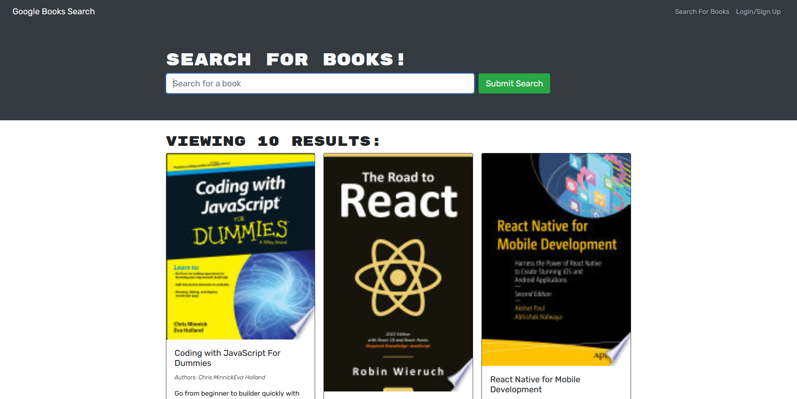

# REST to GraphQL Refactor  
[](http://unlicense.org/)  
## Description  
This project is a refactor af an existing RESTful app. It uses Google books API to allow a user to search for books, which they then can save to their profile.  

## Link to Heroku

[Deployed to heroku](https://google-books-search-demo.herokuapp.com/)

## Screenshot



## Table of Contents  
* [Details](#details)  
       * [Technologies](#technologies)  
* [Installation](#installation)  
* [Usage](#usage)  
* [Contributing](#contributing)  
* [Questions](#questions)  
* [Credits](#credits)  
----  
## Details  
### Technologies  
MongoDB with Mongoose, hosted with a cluster on Atlas. Express-Apollo for serving, React for framework, and Node as an engine.  
  
## Installation  
Use ```npm i`` in the root of the directory after cloning.  
## Usage  
To run development mode with concurrently, use the command ```npm run develop``  
  
----  
  ## Contributing  
If you'd be so kind as to take a look and tell me where I went wrong, I would be grateful for your time. Fork the repo if you're interested.  
## Questions  
  
>Got questions? Reach out to me at:  
>My [Github](https://github.com/JaquelRey)  
>Email: [jaquelrey@gmail.com](mailto:jaquelrey@gmail.com)  
  
----  
  ## Credits  
### Authors  
JR  
### Resources  
Thank you to my classmates for struggling together with me on this.  
